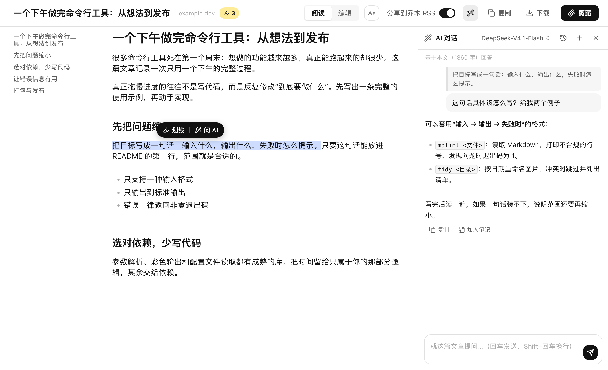
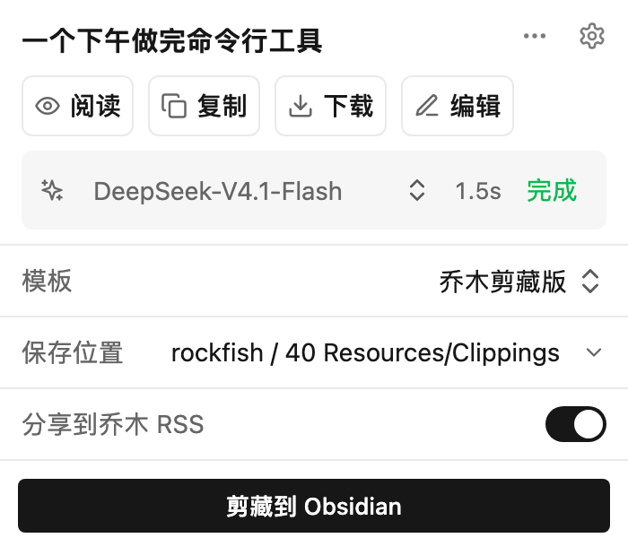
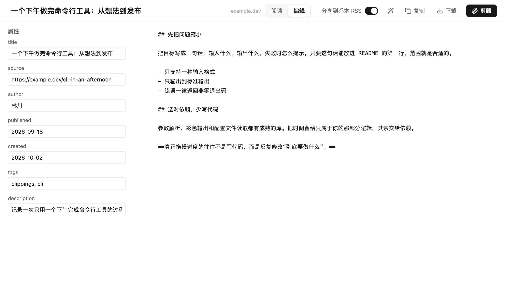
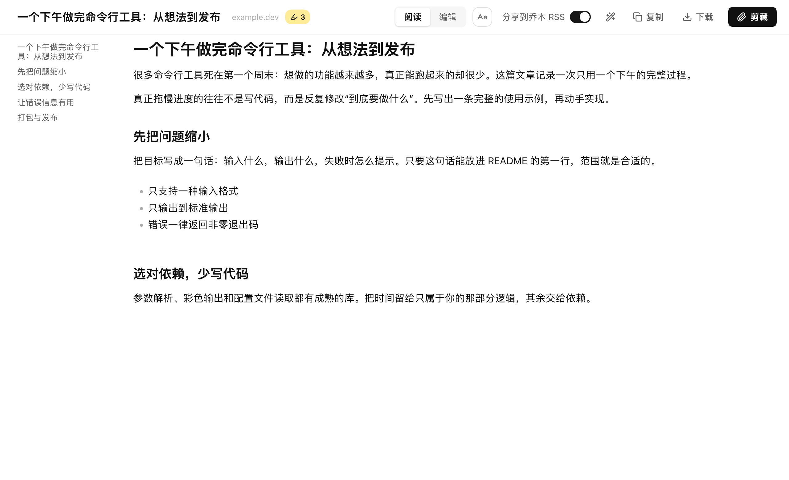

<div align="center">

# 乔木剪藏 · Qiaomu Clipper

**中文** | [English](#english)

**一次点击存进 Obsidian，顺手读完、改好，还能直接问 AI。**



[快速开始](#快速开始) · [功能巡游](#功能巡游) · [快捷键](#三连击快捷键) · [AI](#ai-解读与对话) · [隐私与边界](#隐私与边界) · [反馈](https://github.com/joeseesun/qiaomu-clipper/issues)

  

</div>

> 基于 [Obsidian Web Clipper](https://github.com/obsidianmd/obsidian-clipper) 独立开发，保留上游 Git 历史与 MIT 许可证。当前是 **Chrome 开发版，尚未上架 Chrome 应用商店**，需要从源码加载（约 2 分钟，见下文）。

## 它解决什么问题

剪藏网页时，你大概遇到过这些事：

- 点开剪藏面板，一堆属性和选项挤在一个小窗口里，**想改个标题都费劲**。
- 剪下来的内容**读起来不舒服**，想先看看效果、再决定要不要保存。
- 文章里有一段没看懂，得**复制出去问 AI**，再把答案粘贴回来。
- 想**快速保存**，却每次都要走完整个流程。

乔木剪藏把这几步合在了同一个地方：

| 你想做的事 | 在乔木剪藏里怎么做 |
|---|---|
| 马上存下来 | 弹窗里一个大按钮「剪藏到 Obsidian」，需要时顺便分享到乔木 RSS |
| 先看看剪藏效果 | 点「阅读」进入干净的阅读页，字体、配色可调，还能划线 |
| 改标题、属性、正文 | 点「编辑」进入整页编辑器，属性与 Markdown 并排，空间足够 |
| 不看全文只想要结论 | 点顶栏魔法棒，**对这篇文章直接提问**，回答可一键加入笔记 |
| 没看懂某一段 | 选中文字，点「问 AI」，只围绕这一段提问 |
| 一个键完成动作 | 在网页上**连按 3 次 A / E / Q**：阅读、编辑、直接剪藏（字母可自定义） |

## 功能巡游

### 弹窗：先做最常用的事



阅读、复制、下载、编辑四个快捷动作排在最前；模板、保存位置、RSS 分享是三行同样风格的列表，点开才展开细节；底部是主按钮。模板里写了 AI 提示时，会出现一条安静的状态条，显示模型、用时和完成状态，失败时给出真实原因并可重试。

### 编辑页：属性与正文并排



整页编辑属性和 Markdown，顶部是统一的操作栏：阅读 / 编辑切换、分享到乔木 RSS、复制、下载、剪藏。向下滚动时顶栏自动收起，向上或鼠标靠近顶部再出现。

### 阅读页：舒服地读，顺手划线



- 顶栏标题旁显示来源和**本页划线数量**，不占用正文空间。
- 字体、字号、行距、配色在顶栏的「Aa」里调整；内置**朱雀仿宋**、宋体、楷体、苹方等中文字体，也可以选用电脑里已安装的字体。
- 笔记里的 `==文字==` 在阅读页渲染为高亮。
- 阅读与编辑一键互相切换，编辑过的内容会同步过去。
- 阅读目录可收起／展开；编辑侧栏也提供正文目录，收起后让正文使用更多空间。
- YouTube 视频尺寸可用滑杆调整；字幕区域的「中文翻译」开关使用已配置的 AI 模型逐段翻译，保留原文和时间戳。

### AI 对话：围绕这篇文章提问

点顶栏魔法棒，右侧展开对话面板，正文自动在左侧重新排版，中间的分隔线可以拖动调整宽度。

- 文章全文作为上下文；**选中一段文字**后出现「划线 | 问 AI」小胶囊，只围绕这段提问。
- 流式输出，Markdown 渲染；每条回答可**复制**或**加入笔记**。
- **历史对话按文章保存**，下次打开同一篇文章接着聊，也可以从历史列表切换。
- 对话标题栏的设置按钮可调整字体、字号和自定义指令；保存后用于下一次提问，文章与字幕上下文仍保留。
- 使用你在设置里配置的模型：OpenAI 兼容接口（含 DeepSeek、Azure、Hugging Face 等）、Anthropic、Google Gemini、Ollama。

## 快速开始

**需要：** Node.js 22+、npm、Chrome。

```sh
git clone https://github.com/joeseesun/qiaomu-clipper.git
cd qiaomu-clipper
npm ci
npm run build:chrome
```

1. 打开 `chrome://extensions`，开启右上角「开发者模式」。
2. 点「加载已解压的扩展程序」，选择项目里的 `dist` 文件夹。
3. 打开任意网页，点击工具栏里的回形针图标，开始剪藏。

修改代码后重新 `npm run build:chrome`，在扩展管理页点「重新加载」即可。

<details>
<summary><b>想直接写入笔记库，不弹出 Obsidian？</b>（可选的本地保存助手）</summary>

默认通过 Obsidian URI 保存。如果希望**静默保存**，直接把文件写进笔记库，请安装 [本地助手](native/README.md)（Python 3，macOS / Linux 的 Chrome）。然后在设置 → 通用里选择笔记库根目录，在模板的「保存到文件夹」里选择库内子文件夹。未安装助手时仍可手动填写相对路径。Windows 暂不支持该助手。

</details>

## 三连击快捷键

在任意网页上，**快速连按同一个键 3 次**（间隔不超过约 0.6 秒）：

| 默认按键 | 动作 |
|---|---|
| `A` `A` `A` | 进入阅读页（带划线数量、AI 对话） |
| `E` `E` `E` | 打开编辑页 |
| `Q` `Q` `Q` | 用默认模板直接剪藏 |

- 在设置里可以**改成自己喜欢的字母或数字**，留空即关闭该动作；同一个键不能分配给两个动作。
- 在输入框、文本区里打字时不会触发，带 Ctrl / Cmd / Alt / Shift 的组合也不会触发。
- 可以**按网站关闭**：设置里填写网站列表，或在剪藏面板的「⋯」菜单里一键对当前网站关闭。
- `Q` 在 AI 处理失败时不会保存，避免把没替换的 `{{"…"}}` 原样存进笔记。
- 说明：浏览器自己的页面（如 `chrome://`）不允许扩展运行脚本，快捷键在那里无效。

## AI 解读与对话

- **AI 解读（模板里的提示变量）**：在模板里写 `{{"这篇文章的三点摘要"}}`，剪藏时由模型生成并填入属性或正文。需要在设置的「AI 解读」里添加服务商和模型，并填写 API Key。
- **AI 对话**：见上文，随时围绕当前文章提问，不依赖模板。
- 默认**不自动运行**，避免无意消耗额度；也可以在设置里开启「打开时自动运行」。
- 模型和 API Key 完全由你自己配置；乔木剪藏不提供模型账号或免费额度。

## 其他实用设置

| 设置 | 作用 |
|---|---|
| 默认模板 | 页面没有匹配的模板规则时使用；三连击剪藏也用它 |
| 选中文字工具条 | 一键开关「划线 / 问 AI」小胶囊 |
| 阅读字体 | 内置中文字体，或点击输入框从已安装字体中挑选 |
| 模板自动选用规则 | 按网址或 schema.org 数据自动选择模板 |
| 导入 / 导出全部设置 | 备份、迁移到其他设备 |

## 隐私与边界

- 剪藏默认保存在你本机的 Obsidian 笔记库。
- **「分享到乔木 RSS」默认勾选**。勾选后点击剪藏，会**公开提交**网页链接、标题、剪藏正文和封面图到[公开 RSS](https://rss.qiaomu.ai/feeds/user-submitted.xml)。**请不要把私人页面或个人笔记提交到公开源**，不需要时取消勾选。预览与编辑本身不会上传任何内容。
- AI 解读和 AI 对话会把所需的网页内容发送给你选择的模型服务商，费用按该服务商规则计算。
- 对话历史只保存在本机浏览器里（最多 40 篇文章、每篇 15 段对话）。
- RSS 是独立的在线服务，提交可能因服务限制或网络问题失败；本地保存和 RSS 结果分开显示，重试不会重复创建笔记。
- Firefox / Safari 沿用了上游代码，但乔木相关功能目前只以 Chrome 为验收目标。

详见 [隐私说明](PRIVACY.md) 与 [安全问题反馈](SECURITY.md)。

## 开发与验证

```sh
npm test                      # 单元测试（测试时区已固定，结果不依赖本机）
npx tsc --noEmit              # 类型检查
python3 -m unittest discover -s native -p 'test_*.py'   # 本地助手测试
npm run build:chrome          # 构建 dist/
```

- `src/`：弹窗、阅读页、编辑页、AI 对话、设置与后台脚本。
- `native/`：静默保存助手及安装器，Windows 暂不支持。
- `integration/qmreader/`：RSS 接口参考实现与测试，不随扩展 ZIP 打包。
- [Chrome 应用商店发布准备](docs/CHROME-WEB-STORE.md)：权限、材料、包与验收说明。

README 中的界面截图由当前构建出的页面样式渲染，示例文章为本项目自拟内容。

## 来源与许可证

基于 [Obsidian Web Clipper](https://github.com/obsidianmd/obsidian-clipper)，网页正文提取使用 [Defuddle](https://github.com/kepano/defuddle)，图标来自 Lucide。内置字体 [朱雀仿宋](https://github.com/TrionesType/zhuque) 使用 SIL Open Font License 1.1，许可文本见 [`src/fonts/ZhuqueFangsong-OFL.txt`](src/fonts/ZhuqueFangsong-OFL.txt)。本项目以 [MIT](LICENSE) 许可发布，由 [joeseesun](https://github.com/joeseesun) 维护。

## 关于向阳乔木

- 网站：[qiaomu.ai](https://qiaomu.ai) · 博客：[blog.qiaomu.ai](https://blog.qiaomu.ai) · 推荐：[tuijian.qiaomu.ai](https://tuijian.qiaomu.ai)
- X：[@vista8](https://x.com/vista8) · GitHub：[@joeseesun](https://github.com/joeseesun)
- 微信公众号：**向阳乔木推荐看**

---

<a name="english"></a>

# English

**Qiaomu Clipper — clip the web into Obsidian, read and edit it, and ask AI about it, all from one Chrome extension.**

Save web pages or selected text as Obsidian Markdown notes. Then read the clip in a clean reader, edit its properties and Markdown in a full-page editor, and chat with your own AI model about the article. Optionally share the clip to the public Qiaomu RSS feed.


> Independent project based on [Obsidian Web Clipper](https://github.com/obsidianmd/obsidian-clipper) (upstream history and MIT license preserved). This is a **Chrome development build, not yet on the Chrome Web Store**; load it from source (about two minutes).

### What you get

| You want to… | Do this |
|---|---|
| Save right now | One big button in the popup: *Clip to Obsidian*; optionally share to Qiaomu RSS |
| Preview the clip | *Read* opens a clean reader with adjustable fonts and themes, plus highlights |
| Fix title, properties, body | *Edit* opens a full-page editor: properties beside Markdown |
| Get the gist | Magic-wand button: ask questions about the article; add answers to the note |
| Understand one passage | Select text → *Ask AI* quotes just that passage |
| Skip the mouse | Press **A / E / Q three times** on a page: read, edit, clip (keys are configurable) |

### Quick start

Requires Node.js 22+, npm and Chrome.

```sh
git clone https://github.com/joeseesun/qiaomu-clipper.git
cd qiaomu-clipper
npm ci
npm run build:chrome
```

Open `chrome://extensions`, enable Developer mode, choose **Load unpacked**, and select the `dist` folder. After code changes, rebuild and click *Reload* on the extension card.

By default notes are sent through the Obsidian URI flow. For silent saving straight into your vault, install the optional Python 3 helper for macOS / Linux Chrome: see [native/README.md](native/README.md). Windows is not supported by the helper.

### Highlights

- **Compact popup**: read / copy / download / edit first; template, save location and RSS sharing as one list; a quiet AI status chip that only appears when the template asks for AI, with the real error and a retry on failure.
- **Editor and reader share one top bar**: read/edit switch, RSS toggle, copy, download, clip. The bar hides while you scroll. The reader shows the source and the number of highlights on the page, renders `==highlight==`, and hosts font settings (built-in Chinese fonts including Zhuque Fangsong, or any installed font).
- **AI chat side panel**: streaming answers with Markdown, per-article conversation history, a draggable divider, and a selection toolbar (Highlight | Ask AI) that can be turned off. Supports OpenAI-compatible APIs (including DeepSeek, Azure, Hugging Face), Anthropic, Google Gemini and Ollama — bring your own model and API key.
- **Triple-press shortcuts**: default `A` read, `E` edit, `Q` clip with the default template. Keys are configurable, can be turned off per action and per site, and are ignored while typing. They do not work on browser-internal pages such as `chrome://`.
- **Default template** setting and template auto-selection rules by URL or schema.org data.

### Privacy and limits

- Clips go to your local Obsidian vault by default.
- **"Share to Qiaomu RSS" is checked by default.** When checked, clipping **publicly submits** the URL, title, clipped Markdown and cover image to the [public feed](https://rss.qiaomu.ai/feeds/user-submitted.xml). Do not submit private pages or personal notes; uncheck it when not needed. Previewing and editing never upload anything.
- AI interpretation and chat send the relevant article content to the provider you configure; costs follow that provider. Chat history stays in your browser (up to 40 articles, 15 conversations each).
- RSS is a separate online service and may fail because of limits or network issues; local saving and RSS results are reported separately.
- Firefox and Safari code is inherited from upstream; Qiaomu-specific features are validated on Chrome only.

### Development

```sh
npm test            # unit tests (time zone is pinned in the test config)
npx tsc --noEmit    # type check
python3 -m unittest discover -s native -p 'test_*.py'
npm run build:chrome
```

Screenshots in this README are rendered from the built page styles with a sample article written for this project. See [privacy](PRIVACY.md), [security reporting](SECURITY.md) and the [MIT license](LICENSE). The bundled font Zhuque Fangsong is under the SIL OFL 1.1 ([license text](src/fonts/ZhuqueFangsong-OFL.txt)). Maintained by [joeseesun](https://github.com/joeseesun).

### YouTube 沉浸学习

在 YouTube 视频页、非输入框内快速按 `aaa` 直接打开学习页，先显示播放器，字幕异步加载；加载超时或失败可原地重试，不重启播放器：上方播放器，下方带时间戳的字幕文稿。文稿工具栏可复制字幕、下载 TXT，并使用设置中启用的 AI 模型基于文稿对话。点击字幕时间戳可跳转播放，支持跟随高亮。没有获取到字幕时会显示原因提示并禁用字幕操作；可先打开 YouTube 自带转写面板再重试。
