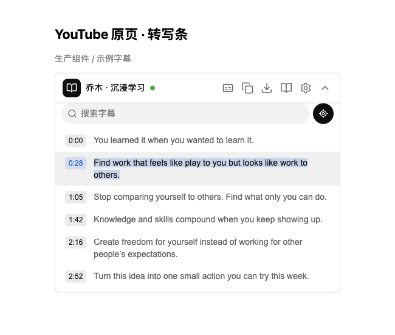
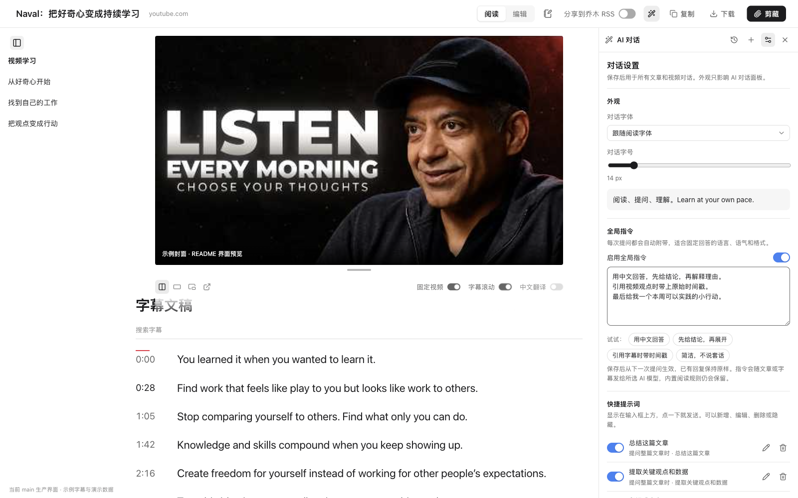

<div align="center">

# 乔木剪藏 · Qiaomu Clipper

**中文** | [English](#english)

**别让好文章和好视频，停在「收藏过」。**

边读边问 AI，边看视频边记理解，把内容与想法存进 Obsidian。

Read, watch, ask AI, and turn what you learn into Obsidian notes.

**[安装并体验最新功能](#快速开始)** · [看功能截图](#功能巡游) · [快捷键](#三连击快捷键) · [反馈问题](https://github.com/joeseesun/qiaomu-clipper/issues)


  

</div>

> **当前为 Chrome 开发版，尚未上架应用商店。** 本页介绍当前 `main` 的功能；完整体验请按下方步骤从源码安装。[1.10.0 预览包](https://github.com/joeseesun/qiaomu-clipper/releases/tag/1.10.0) 较旧，不包含这里全部新增功能。截图采用实际界面组件与示例数据，视频区域展示封面预览；[截图说明](docs/README-SCREENSHOTS.md)。

## 它解决什么问题

| 你遇到的痛点 | 直接这样做 | 得到什么 |
|---|---|---|
| 收藏一堆文章，还是没读懂 | `aaa` 进入阅读页，划线或选中一段问 AI | 干净正文、局部解释，阅读与提问留在同一页 |
| 看视频时，播放器和文稿来回切 | YouTube / B 站按 `aaa`，点击字幕时间戳 | 视频与字幕同屏，回到想复习的那句话 |
| 外语字幕看得慢，找一句话又要拖进度条 | 打开「中文翻译」，搜索字幕关键词 | 原文、中文、时间戳对照，字幕也能复制和下载 |
| 视频里突然有想法，切去记笔记就忘了 | 按 `N` 打开小卡片，写下「我的理解」 | 带来源与时间点的记录追加到今天的 Obsidian 日记¹ |
| 每次问 AI 都要重写回答要求 | 对话设置里保存全局指令、常用提示词 | 固定语言和回答方式，字体、字号也按你的习惯来 |
| 剪藏弹窗太小，整理标题和正文费劲 | `eee` 进入整页编辑器，收起目录腾出空间 | 属性与 Markdown 并排，编辑完直接剪藏 |
| 保存一篇文章总要反复点按钮 | `qqq` 用默认模板剪藏 | 快速保存到 Obsidian；是否公开分享到 RSS 由开关决定 |

¹ 写入今天日记需要安装本地助手并启用 Obsidian「日记」核心插件，详见[学习笔记](#学习笔记把自己的理解留下来)。

## 快速开始

**需要：Node.js 22+、npm、Chrome；保存笔记需要 Obsidian。**

```sh
git clone https://github.com/joeseesun/qiaomu-clipper.git
cd qiaomu-clipper
npm ci
npm run build:chrome
```

1. 打开 `chrome://extensions`，开启右上角「开发者模式」。
2. 点「加载已解压的扩展程序」，选择项目里的 `dist` 文件夹。
3. 打开一篇文章或 YouTube 视频，在非输入框内快速连按 **`aaa`**。
4. 想问 AI 或翻译字幕：在扩展设置 → **AI 解读**中添加你自己的模型与 API Key。

**先试一条完整流程：** 打开视频 → `aaa` → 点时间戳回看 → 按 `N` 写理解。只想读文章和复制字幕，无需配置 AI；写入日记需先装下方助手。

<details>
<summary><b>不想安装 Node.js？也可以先试较旧的 1.10.0 预览包</b></summary>

下载 [Chrome ZIP](https://github.com/joeseesun/qiaomu-clipper/releases/download/1.10.0/qiaomu-clipper-1.10.0-chrome.zip)，解压后在 `chrome://extensions` 中加载解压目录。[发布说明](https://github.com/joeseesun/qiaomu-clipper/releases/tag/1.10.0)。它不包含当前 `main` 的全部视频学习、日记和 AI 设置更新，体验本页新功能请使用源码构建。

</details>

<details>
<summary><b>想静默写入笔记库，或把学习笔记追加到今天日记？</b></summary>

安装可选的 [本地助手](native/README.md)：需要 Python 3.9+，支持 macOS / Linux 的 Chrome 系浏览器（Chrome / Edge / Brave / Arc 等），Windows 暂不支持。先装好扩展，再在仓库里运行（无需任何参数，自动识别扩展 ID 和 Obsidian 库）：

```sh
python3 native/install.py
```

输出 `"ok": true` 即安装成功，然后在 `chrome://extensions` 重新加载扩展。遇到「本地保存助手未连接」，运行 `python3 native/install.py --check` 诊断。

**让 AI agent 代装**：把这句话发给 Claude Code / Codex：「帮我安装乔木剪藏的本地保存助手：克隆 https://github.com/joeseesun/qiaomu-clipper ，在仓库里运行 `python3 native/install.py`，不要手动编造扩展 ID 或库路径；`ok: false` 时按 `error` / `hint` 处理，有多个库时问我用哪个。」

普通剪藏默认通过 Obsidian URI 保存；助手可直接写入库内文件。

学习笔记的日记追加也由助手完成。升级扩展后，按助手文档重新运行一次 `native/install.py`；在 Obsidian 中启用「日记」核心插件。目前要求纯数字日期格式（如 `YYYY-MM-DD`），不支持日记模板。目标不满足条件时会显示原因并保留草稿。[日记设置与保存说明](docs/LEARNING-DIARY.md)。

</details>

更新源码后，重新运行 `npm run build:chrome`，并在扩展管理页点「重新加载」。

## 功能巡游

以下暖色配图是 **AI 生成的功能概念插画**，用于说明工作流；可展开查看界面截图。视频配图中的“书”是阅读体验的比喻。完整素材与提示词见[功能插画图集](docs/FEATURE-ILLUSTRATIONS.md)。

### 视频学习：播放器与文稿一起用


<details>
<summary>查看视频学习截图</summary>


</details>

在 **YouTube / B 站视频页按 `aaa`**，先进入学习页并显示播放器，再异步加载字幕。字幕还没准备好时也不用卡在剪藏面板；失败可在原地重试，播放器保留。

- **同一套操作习惯**：延续普通阅读页的顶栏、阅读 / 编辑切换与复制、下载、剪藏流程；视频专属控件放在视频下方。
- **空间跟着你调整**：宽屏视频与字幕并排，窄屏上下排列；拖动分隔线或尺寸手柄调大小，可切换停靠、剧场、角落小窗。支持的 Chrome 还可把 YouTube 浮出为独立窗口；该动作会重新加载并恢复进度。
- **文稿可以检索和复用**：搜索关键词，点击时间戳跳转；YouTube 支持播放跟随与当前行高亮。手动浏览原页字幕时暂停自动滚动，之后恢复跟随。字幕可复制、下载 TXT。
- **双语对照**：打开「中文翻译」，中文出现在非中文原文下方，保留时间戳；关闭可取消未完成请求，失败可重试。需要已配置的 AI 模型，会使用该模型额度。
- **基于文稿提问**：让 AI 总结观点、解释某一段或给出实践建议。无字幕时明确提示，不能把页面简介当作完整视频文稿。

B 站使用官方嵌入播放器：点击时间戳会按该秒重新加载，高亮只跟随点击行；字幕通常需要登录 B 站。字幕是否可用也取决于视频、站点加载和网络条件。[视频工作区说明](docs/STUDY-WORKSPACE.md)。

### 双语字幕：英文视频，中文对照


原文与中文译文对照阅读，保留原始时间戳；读到某一句时，可以点击时间戳回看对应片段。翻译使用你配置的 AI 模型，字幕是否可用取决于视频与平台。

### YouTube 原页：不打开面板，也能找到字幕入口



视频页右栏顶部常驻「转写条」：**字幕 / 复制 / 下载 / 沉浸学习 / 设置**。展开即可搜索、看当前播放行或点时间跳转；「沉浸学习」进入完整学习页。可自动打开 YouTube 原生转写面板作为字幕来源，设置里可关闭。上图为转写条组件预览，使用示例字幕。

### 学习笔记：把自己的理解留下来


<details>
<summary>查看学习笔记截图</summary>


</details>

不用切走视频，也不用先建一篇新笔记。按 **`N`**（或在任意网页三连按 `iii`），底部居中出现一张小卡片，不挡视频，也不压右侧的聊天栏。**不选文字也能记**，想到什么写什么。

- **摘录、来源与时间各有一个开关**：选中了文字才会出现「摘录」；来源默认记录当前页面的标题和地址（视频带时间点），随时可以关掉，也可在设置页改默认。关掉只是不写进日记，文字仍留在草稿里。点「编辑」可以改来源标题、链接和时间，再点「收起」回来。
- 选中文字 → **记笔记**；也可从已有高亮选摘录。AI 回答 → **加入日记**，先进入卡片，继续写自己的理解。
- 底部一行小灰字显示写入的库和日期，鼠标悬停看完整路径；成功后字幕行出现笔记标记，复习时能找回记录。
- 关闭卡片会保留草稿并提示「已恢复草稿」；写入失败可修改、重试。**学习笔记不提交到公开 RSS。**
- 日记里只留下笔记本身：一行「时间 · 来源链接 · 视频时间点」，再是你的话和可选的摘录，不夹带任何标记注释；过长的页面标题会截短，零宽字符会被清掉。

实际写入需要上面的本地助手（升级后重新运行一次 `native/install.py`）；截图使用示例视频和演示库，并未写入真实笔记库。

### AI 对话：理解本文，也按你的习惯回答


<details>
<summary>查看 AI 对话截图</summary>


</details>

点顶栏魔法棒，展开右侧对话面板；全文或选中段落作为上下文，回答流式显示并支持 Markdown。中间分隔线可拖动；对话历史按文章保存，下次打开可继续聊。回答可复制、加入笔记或通过学习卡片加入日记。

<details>
<summary>查看 AI 对话设置截图</summary>



</details>

标题栏的 **设置按钮**支持：

- 字体跟随阅读页，也可单独设置；字号可调为 **12–28 px**。
- 保存全局自定义指令，例如「用中文、先结论、引用字幕带时间戳」，可随时关闭。
- 新增、编辑、隐藏或删除快捷提示词，分别用于整篇文章和选中文字。
- 保存后用于后续文章、视频提问，原有对话不被重写。

支持 OpenAI 兼容接口、Anthropic、Google Gemini、Ollama 等，由你提供模型和 API Key。模板也可使用 `{{"这篇文章的三点摘要"}}` 自动生成笔记内容；默认不自动运行 AI，可在设置中调整。

### 阅读与编辑：读得舒服，改得方便


<details>
<summary>查看阅读页截图</summary>


</details>

在顶栏 **Aa** 调整字体、字号、行距与配色；内置朱雀仿宋、宋体、楷体、苹方等中文字体，也可选本机字体。正文支持划线与 `==高亮==`，顶栏显示划线数量。

**阅读目录与编辑侧栏都能收起 / 展开，并记住状态**，长文章保留导航，需要空间时让正文铺开。阅读与编辑一键切换，共用顶栏与草稿流程，修改后内容同步。


<details>
<summary>查看编辑页截图</summary>


</details>

标题、标签、来源等属性与 Markdown 正文并排编辑，完成后直接复制、下载或剪藏。滚动时顶栏可收起，向上滚动或移到顶部再次出现。

### 弹窗：保存之前，少做几次选择


<details>
<summary>查看弹窗截图</summary>


</details>

常用动作放在前面：**阅读 / 复制 / 下载 / 编辑**；模板、保存位置与 RSS 分享按需展开。模板需要 AI 时显示处理状态，失败给出原因并允许重试；默认模板与自动匹配规则减少重复选择。

### 模板与 AI 解读：照着模板，自动整理


用模板统一属性与 Markdown 正文，按网址或页面数据自动匹配；需要摘要时加入 AI 提示变量，由你配置的模型按需生成。模板、模型和 API Key 均可自行设置，默认不自动运行 AI。

### RSS 分享：好文章，一起读


剪藏时勾选「分享到乔木 RSS」，在保存到 Obsidian 的同时提交到[公开读者提交源](https://rss.qiaomu.ai/feeds/user-submitted.xml)，方便其他人订阅。**此选项默认关闭（设置页可改为默认开启），投稿内容会公开。** 本地保存和公开投稿分别显示结果，阅读、编辑与学习笔记的日记保存不会触发投稿。

## 三连击快捷键


在非输入框内快速连按同一个键 3 次（相邻按键间隔不超过约 0.6 秒）：

| 默认按键 | 动作 |
|---|---|
| `aaa` | 网页阅读；YouTube / B 站视频学习 |
| `eee` | 整页编辑 |
| `qqq` | 用默认模板直接剪藏 |
| `iii` | 在任意网页打开学习笔记小卡片（选中的文字成为摘录；YouTube / B 站自动记录当前播放时间） |
| 选中文字 → 右键「保存到日记」 | 同一张笔记卡片，选中的文字作为摘录 |
| `N`（学习页） | 在阅读、学习页打开同一张笔记卡片 |

三连击的字母或数字可自定义，留空可关闭；可按网站禁用。在输入框中打字或带 Ctrl / Cmd / Alt / Shift 时不触发。浏览器内部页（如 `chrome://`）不允许扩展脚本。直接剪藏的 AI 处理失败时不会保存未替换的提示变量。

## 隐私与边界

- **「分享到乔木 RSS」默认关闭**：勾选后剪藏会公开提交链接、标题、剪藏正文和封面到[公开源](https://rss.qiaomu.ai/feeds/user-submitted.xml)。阅读、编辑本身不会提交。学习笔记的日记保存独立于这个开关，不提交 RSS。
- AI 提问、模板解读和字幕翻译会把所需内容发送给你选择的模型服务商；费用由该服务商计算。插件不提供模型账号或免费额度。
- 对话历史保存在本机浏览器（最多 40 篇文章，每篇 15 段对话）。本地保存与 RSS 结果分开显示，失败可重试。
- 当前以 **Chrome** 为验收目标。Firefox / Safari 沿用上游代码；Windows 不支持本地助手。
- 界面截图展示组件与交互，不代表所有视频均有字幕，也不替代真实扩展中的播放、跨窗口恢复、真实 AI 请求与日记写入验收。

[隐私说明](PRIVACY.md) · [安全问题反馈](SECURITY.md) · [提交使用反馈](https://github.com/joeseesun/qiaomu-clipper/issues)

## 开发与验证

```sh
npm test                      # 单元测试（测试时区已固定，结果不依赖本机）
npx tsc --noEmit              # 类型检查
python3 -m unittest discover -s native -p 'test_*.py'   # 本地助手测试
npm run build:chrome          # 构建 dist/
```

- `src/`：弹窗、阅读页、编辑页、AI 对话、设置与后台脚本。
- `native/`：静默保存助手及安装器，Windows 暂不支持。
- `integration/qmreader/`：RSS 接口参考实现与测试，不随扩展 ZIP 打包。
- [Chrome 应用商店发布准备](docs/CHROME-WEB-STORE.md)：权限、材料、包与验收说明。

暖色功能插画由 AI 生成，不是界面截图；完整素材与提示词见[功能插画图集](docs/FEATURE-ILLUSTRATIONS.md)。界面截图基于生产界面样式或组件渲染，示例文章与字幕用于展示交互。[截图来源与验收边界](docs/README-SCREENSHOTS.md)。

## 来源与许可证

基于 [Obsidian Web Clipper](https://github.com/obsidianmd/obsidian-clipper)，网页正文提取使用 [Defuddle](https://github.com/kepano/defuddle)，图标来自 Lucide。内置字体 [朱雀仿宋](https://github.com/TrionesType/zhuque) 使用 SIL Open Font License 1.1，许可文本见 [`src/fonts/ZhuqueFangsong-OFL.txt`](src/fonts/ZhuqueFangsong-OFL.txt)。本项目以 [MIT](LICENSE) 许可发布，由 [joeseesun](https://github.com/joeseesun) 维护。

## 关于向阳乔木

- 网站：[qiaomu.ai](https://qiaomu.ai) · 博客：[blog.qiaomu.ai](https://blog.qiaomu.ai) · 推荐：[tuijian.qiaomu.ai](https://tuijian.qiaomu.ai)
- X：[@vista8](https://x.com/vista8) · GitHub：[@joeseesun](https://github.com/joeseesun)
- 微信公众号：**向阳乔木推荐看**

---

<a name="english"></a>

# English

**Turn saved articles and watched videos into something you understand — and keep it in Obsidian.**

Qiaomu Clipper combines web clipping, a clean reader, a full-page Markdown editor, contextual AI chat, and video study. Press `aaa` on YouTube or Bilibili to study with the player and transcript together. Search, seek, copy, download, translate, and take notes without leaving the page.

**[Install current features](#quick-start)** · [Screenshots](#功能巡游) · [Report an issue](https://github.com/joeseesun/qiaomu-clipper/issues)

> Chrome development build; not yet on the Chrome Web Store. This README describes current `main`. The downloadable [1.10.0 preview](https://github.com/joeseesun/qiaomu-clipper/releases/tag/1.10.0) is older and does not contain all features shown here. Screenshots use production components with sample articles, captions, AI responses and daily-note targets; the video area is a cover preview. See [screenshot provenance](docs/README-SCREENSHOTS.md).

### Quick start

Requires Node.js 22+, npm, Chrome, and Obsidian to save notes.

```sh
git clone https://github.com/joeseesun/qiaomu-clipper.git
cd qiaomu-clipper
npm ci
npm run build:chrome
```

Open `chrome://extensions`, enable Developer mode, choose **Load unpacked**, and select `dist`. Open an article or video, then press `aaa` outside an input field. Rebuild and reload the extension after pulling updates.

For AI chat or translation, configure your own model and API key in the extension's AI settings. Reading and copying captions do not require AI. To save silently or append learning notes to today's daily note, install the optional Python 3 [local helper](native/README.md) for macOS / Linux Chrome; run `python3 native/install.py` (no arguments; it detects the extension ID and vault) and re-run it after upgrading; `--check` diagnoses a "helper not connected" error, and an AI agent can run the same command for you. Daily-note append requires Obsidian's Daily notes plugin with a numeric date format and no template.

### What you can do

The Chinese feature tour includes ten matching AI-generated concept illustrations for clipping, reading and highlights, editing, AI chat, video study, bilingual captions, learning notes, shortcuts, templates and RSS sharing. They illustrate workflows, not literal interfaces. Rendered interface screenshots remain in expandable panels; see the [illustration gallery and prompts](docs/FEATURE-ILLUSTRATIONS.md).

| Problem | Feature |
|---|---|
| Switch constantly between video and captions | Player and transcript together; responsive layout, draggable size, dock / theater / corner window; supported Chrome also offers a separate YouTube window |
| Miss a phrase or struggle with foreign captions | Transcript search, timestamp seeking, copy / TXT download, Chinese translation below the original |
| Lose your own thoughts while watching | Press `N` to write in a small card, with source and video time; append to today's daily note using the helper |
| Re-type the same AI instructions | Global custom instructions, editable article / selection quick prompts, font choice and 12–28 px chat size |
| Need a better place to read and edit | Shared top bar, collapsible navigation, Chinese fonts, highlights, side-by-side properties and Markdown |
| Too many steps to clip | Configurable triple-press shortcuts: `aaa` read / study, `eee` edit, `qqq` clip; site exclusions and typing guards |

Video loads before captions; caption failure can be retried without rebuilding the player. YouTube supports playback-following highlights. Bilibili uses its official embed: timestamp seeking reloads the player and captions highlight the clicked row rather than following playback; captions may require login. Actual availability depends on the video, site and network.

AI answers stream with Markdown; history stays per article, panel width is adjustable, and answers can be copied or added to notes. Supported providers include OpenAI-compatible APIs, Anthropic, Google Gemini and Ollama. Templates can also use `{{"Summarize this article"}}` to generate note content. Bring your own provider; the extension includes no AI account or credits.

### Privacy and limits

- **Share to Qiaomu RSS is enabled by default.** When clipping with it on, the URL, title, clipped Markdown and cover image are submitted to a [public feed](https://rss.qiaomu.ai/feeds/user-submitted.xml). Turn it off for private content. Reading and editing do not submit anything. Learning-note daily saves never submit to RSS.
- AI features send necessary source content and your instructions to the provider you configure, at that provider's cost. Chat history remains in your local browser (up to 40 articles, 15 conversations each).
- Local saving and RSS submission report results separately. Closing the learning-note card preserves its draft; failed writes can be retried.
- Chrome is the current target. Firefox / Safari inherit upstream code; the local helper does not support Windows.
- The screenshots demonstrate interface components, not universal caption availability or completed live playback, AI and vault-write verification.

See [Privacy](PRIVACY.md), [Security](SECURITY.md), [video study](docs/STUDY-WORKSPACE.md), and [daily-note setup](docs/LEARNING-DIARY.md).

### Development and license

Run `npm test`, `npx tsc --noEmit`, `python3 -m unittest discover -s native -p 'test_*.py'`, and `npm run build:chrome`.

Independent [MIT](LICENSE) project based on [Obsidian Web Clipper](https://github.com/obsidianmd/obsidian-clipper), preserving upstream history. Built with [Defuddle](https://github.com/kepano/defuddle) and Lucide; Zhuque Fangsong uses the SIL Open Font License. Maintained by [joeseesun](https://github.com/joeseesun).
