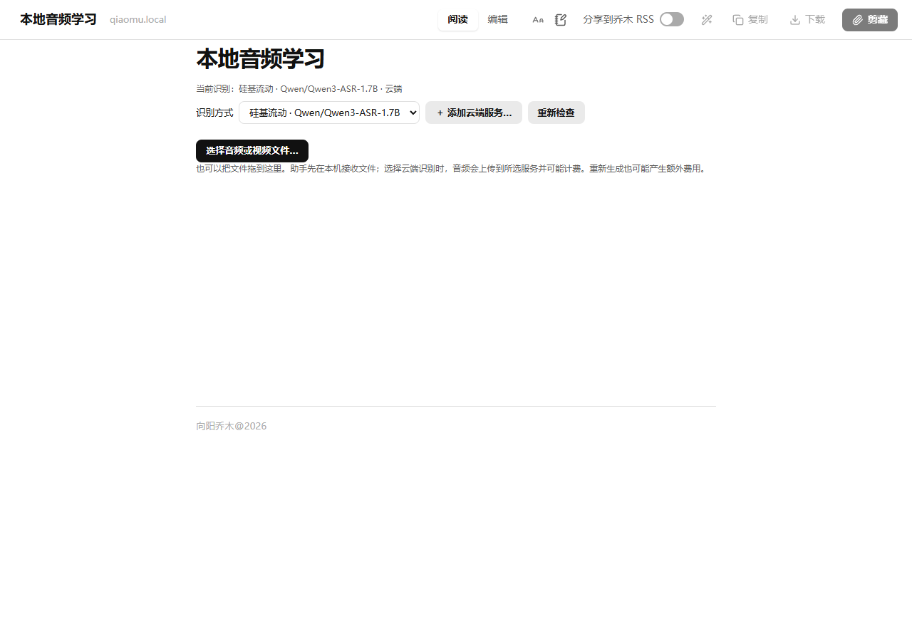
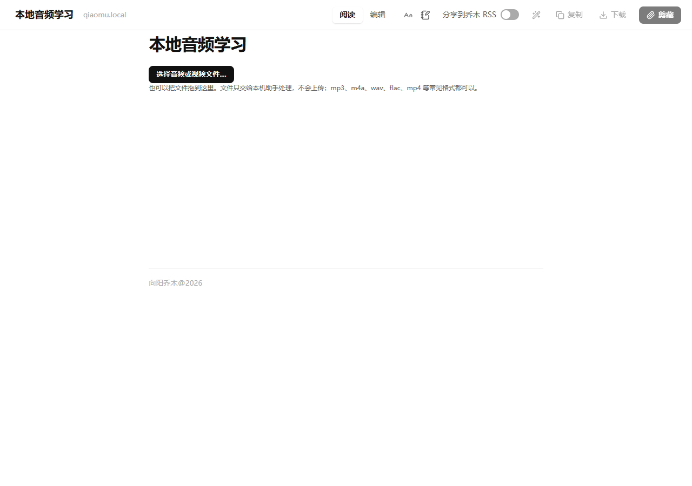
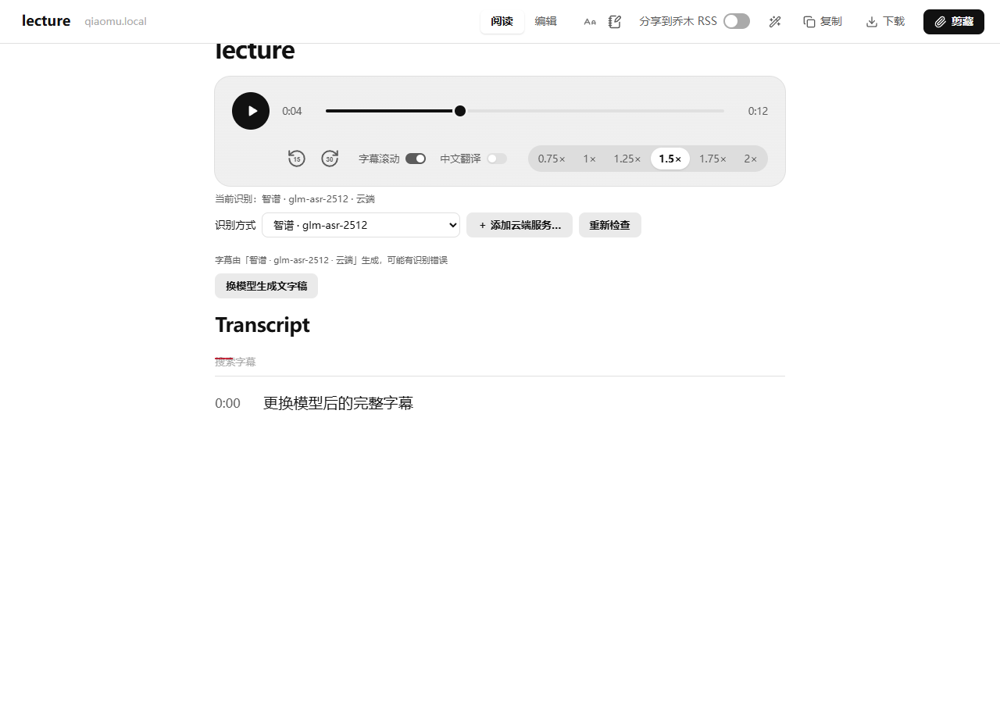

# 本地文件学习：交接、字幕更新与模型选择回归记录

基线：upstream `main` / 1.15.8，`37b35ddeb97fdc540cfb4904f297eaef7c3139c6`。不修改云端请求协议、模型安装逻辑或已有 API 配置。

## 复现与前后效果

1. 在学习首页选择音频/视频，打开 `reader.html?study=file&token=…`。
2. 初次转写完成后，点击重新生成并确认（可以先切换云端服务）。
3. 原版先消费 IndexedDB token，重做保存成功后刷新页面；旧 token 已删除，文件和播放器丢失，页面回到空白选文件状态。
4. 原版直接打开本地文件学习页时，选择文件前看不到供应商和模型；已启用自动生成时也缺少当次费用确认。

以下截图使用同一隔离 Edge 环境、12 秒合成 WAV 和模拟 Native Messaging，未发送私人音视频或调用收费 API。

| 场景 | 原版 1.15.8 | 修复版 |
| --- | --- | --- |
| 选择文件前 |  |  |
| 重新生成后 |  |  |

## 改动策略与审查顺序

- `file-handoff.ts`：等待 IndexedDB 事务提交；读取不立即消费，只有助手确认接收后删除 token。失败可重试，不同 token 不互相消费，过期 token 给出明确提示。
- `audio-study.ts`、`reader-transcript.ts`：完整字幕原位替换，重新绑定时间轴并清理旧监听/移动后的控件；保留同一个播放器、播放位置和速度。取消或生成失败保留上一份完整结果。缓存写入和 UI 展示分开；浏览器缓存失败明确提示“识别成功”并提供导出，不误报 ASR 失败。
- `file-study-session.ts`：同一标签页刷新恢复文件 hash、标题及已确认任务入口。成功字幕使用已有缓存；正在运行的任务保存助手返回的任务 ID，刷新仅用 `asrPoll(jobId, 0)` 重新连接。页面离开只停止观察，不取消后台任务。
- `bar-generation.ts`、`local-save.ts`：复用现有 ASR 配置、choices 和确认面板。文件选择前显示当前供应商/实际模型，切换等待保存成功；文件页始终确认后才开始识别，提醒上传与额外费用。仅返回原有脱敏摘要加模型名，绝不返回密钥；未安装的本地模型不会被静默选中。
- `install.py`：保留用户环境，Windows 不再丢失 USERPROFILE/SystemRoot/PATH；Unix 仍限制工具 PATH 但保留 HOME。分别报告本地和云端可选能力，不把缺少本地模型作为助手注册失败。

## 兼容性与隐私

不增加扩展权限，不改变缓存 key `generated:file:<hash>` 或原生上传 key；既有 1.15.8 助手支持本修复。其他学习页保留原自动生成策略。新增模型字段可选，对旧状态响应兼容。

浏览器不持久化额外原始视频副本：交接中的 File 沿用原有一小时有效期，助手接收成功立即删除；未接收的条目在读取、新提交或后台 worker 唤醒时清理（浏览器完全空闲时不会按时主动唤醒）。标签页 sessionStorage 仅存 hash、展示标题、时间、pending 标记及原任务 ID，最长恢复窗口 24 小时，不存 File、blob URL、完整路径或 API Key。原有助手上传/转写缓存策略不变。

手动刷新后字幕和标题可恢复，但浏览器文件访问权限不能无提示恢复；页面明确要求重新选同一文件才能播放，命中成功缓存不重新收费识别。重做字幕无需刷新，播放器持续存在。永久关闭标签页后的恢复入口仍为重新选择同一文件。

## 已执行验证

- 最终 Windows 前端可移植测试：107 文件 / 902 测试通过；类型检查、Chrome 商店版与本地版生产构建、发行边界检查通过，构建只有已有体积警告。
- Windows 原版完整前端套件有 6 个 CRLF 敏感模板断言失败；修复版相同 6 项失败。上述 902 项仅排除该原有 `template-integration.test.ts`。Linux 完整套件由 PR/fork CI 再验证。
- Windows 原生相关测试：安装 30、恢复 23、自检 3，共 56 项通过。完整原生 Windows 套件原版 167 项和修复版 170 项各有 50 项失败/错误，涉及原有 Unix shell、HTTP/主机/编码测试；未扩大范围修复这些项目。
- 真实已安装 Windows helper 只读探测：原诊断复现 `Could not determine home directory.`；修复后本地能力报告缺少 Whisper，云端能力 `ready=true`、无缺失项、无需模型下载。未安装模型或改动配置。
- 原版生产扩展在 Edge 复现重做后丢失字幕/播放器；新回归测试放回原版会失败。最终修复版 Edge 149.0.4022.52 生产扩展通过 8 项验收，无 page error：文件前模型显示、自动生成仍须确认、交接成功才消费 token、原位替换保留播放位置/速度/单组控件、刷新缓存恢复与重新选文件免重识别、刷新按任务 ID 查询后台任务、上传失败重试、重做失败保留结果。

可选浏览器验收脚本：先 `npm run build:local`，安装 Playwright 后运行 `node scripts/test-local-study-edge.cjs`；可用 `QIAOMU_PLAYWRIGHT`、`QIAOMU_EDGE`、`QIAOMU_TEST_OUTPUT` 指定运行环境。测试使用独立临时 profile 和合成文件，不读取真实用户配置。

## 待作者/用户最低限人工验收

真实 Edge 用户配置、真实硅基流动 Qwen3-ASR 和大视频端到端转写尚未验证，模拟测试不能代替这些场景。请用原视频检查：文件前显示并选择正确云端模型 → 确认并识别 → 换模型重做 → 检查新字幕/标题/播放时间 → 识别中刷新 → 完成后刷新并重新选同一文件。验证不会回退到已卸载模型、不会丢成功结果；真实云端重做可能产生额外费用。

PR 留待作者人工审查、合并与发布；此分支不会自动合并或升级用户安装。

## 合并前补充修复：刷新只查询原任务

审核复现了一个缺口：`asrStart(force=false)` 在原任务已失败、被取消或缓存不可用时仍可能创建新任务，导致刷新自动重做云端识别。

现在保存助手已确认的任务 ID；刷新只调用 `asrPoll(jobId, 0)` 并按游标继续查询，不调用 `asrStart`、不受当前模型/语言配置变化影响。原任务失败、取消、丢失或连接中断时显示对应结果，重试必须再次确认。尚未取得任务 ID 的旧会话和请求窗口也只显示确认，不自动启动。

新增回归覆盖后台失败/取消/任务丢失、旧会话缺少 ID、恢复时完整字幕与游标、任务身份不符、页面离开和原生终态查询。真实付费云端 API 仍未调用。
