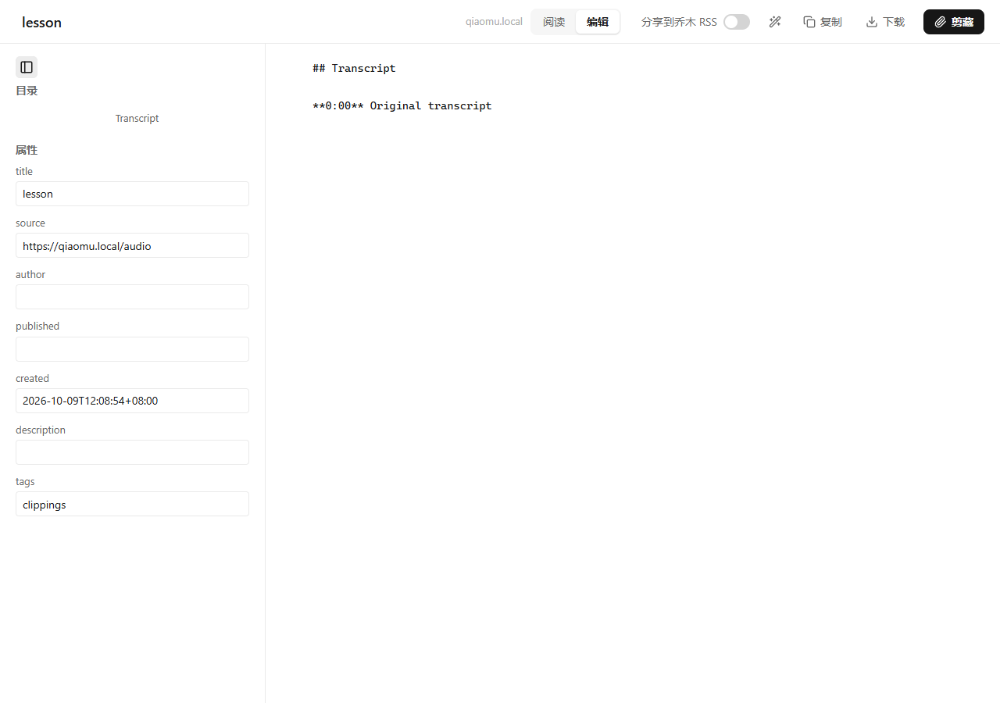
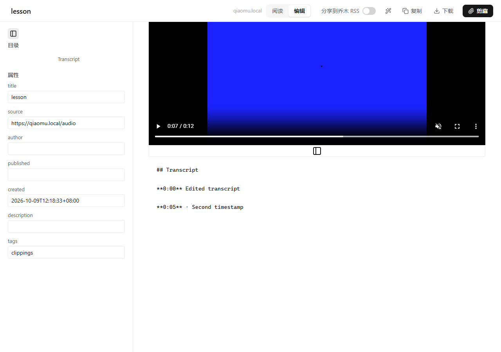
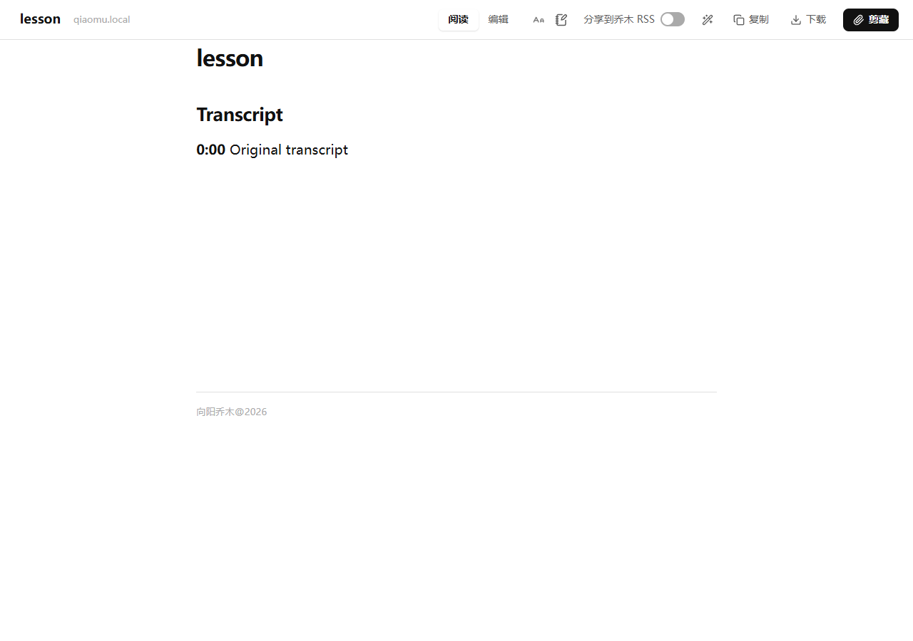
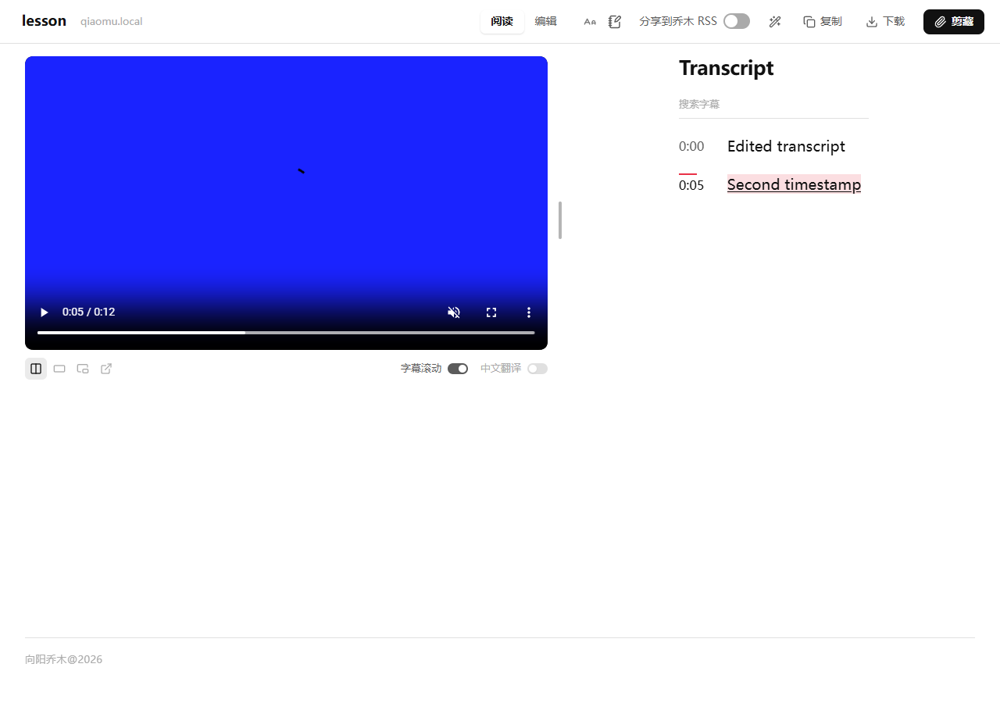

# Local media survives reading/editor navigation

## Reproduction and cause

On the PR #57 production extension, choose a local video, complete transcription, then select Edit and Reading. Both destination pages show captions but no video. Reproduced in isolated Edge with a synthetic 12-second WebM and mocked Native Messaging; no user files or paid recognition calls.

The learning page owns a File and a document-local blob URL. The mode bar navigates to editor.html?id=… and reader.html?preview=…, which restore only the text draft. The original upload handoff is correctly acknowledged and deleted; its playback URL is revoked on pagehide. A new page therefore has neither a File reference nor a usable player.

## Change

- Before a file-learning page opens the editor, commit a separate temporary File handoff and save its random token, file metadata and playback position/rate/volume/mute in the preview draft. Await both the IndexedDB transaction and draft save before navigating. A failure stays on the playable page and shows an error.
- The editor and reading preview read that handoff without consuming it, create their own blob URL, restore playback state after metadata loads, and revoke their own URL on pagehide. Playback starts paused. Plain clips do not use this file path; online study players use the separate session-scoped playback path described below.
- Reading uses the current edited Markdown timestamp paragraphs to rebuild the transcript; it does not replace edits with old ASR output. Changed editor content resets the previous transcript-export snapshot to avoid appending duplicate captions on subsequent switches.
- If temporary playback access expired, offer reselect of the same name/size/modified file while retaining captions and edits. This recovery path makes no helper upload or recognition request.
- Files are held only in the existing one-hour handoff store, swept on reads/writes/background wake. The original upload token is still deleted after receipt; the playback token is separate and created only for mode navigation. No File bytes or blob URL are stored in Chrome text storage, sessionStorage, URLs, Markdown exports or notes. The local temporary File reference can consume browser storage; storage failure is visible and blocks navigation instead of silently losing the player.

This change is based on the author's c0478ac and 7412d9d follow-ups to PR #57, preserving original-task polling and paginated-caption draining. No helper, API setting, model, extension permission or Obsidian file is changed.

## Validation

- Windows portable frontend suite: 108 files / 924 tests pass. Excluded only the pre-existing template-integration file with CRLF-sensitive fixtures; Linux CI runs the full suite.
- Seven new unit tests cover save failure, transaction refusal, fresh URL and playback restoration, expired-file recovery, timestamp conversion and ordinary clips.
- TypeScript, local and store production builds, and edition/ID/permission checks pass; only existing bundle-size warnings.
- Edge 155 production build: seven checks pass with no page errors. Verified editor playback state, reading with edited captions, exact timestamp handler and pointer seeking, repeated switches without duplication, editor refresh, expired token recovery, and safe failure when browser storage is unavailable. Total simulated helper calls remain one upload and one recognition across all mode transitions and recovery.
- The existing local-study production Edge suite also passes all nine checks, including the author's original-task polling, failed-task restoration and paginated-caption changes; 16 browser checks pass in total.
- Browser test: `QIAOMU_PLAYWRIGHT=… QIAOMU_TEST_VIDEO=… node scripts/test-local-media-modes-edge.cjs`. Generate a harmless short WebM with ffmpeg or supply a synthetic fixture. Set QIAOMU_TEST_BASELINE=1 and QIAOMU_TEST_DIST to the PR #57 pre-fix production extension to reproduce missing video.

Limitations: the live user Edge profile has no accessible browser-control connection in this session. The old already-broken page has lost its File reference; once the updated extension is reloaded, select the original file once from the learning page to recover playback from the successful transcript cache. This does not require regenerating captions. Private large files, storage quota limits with multi-GB video, and real paid ASR are not exercised by synthetic tests. Refresh of the original learning route still follows its existing reselect behavior; this patch preserves mode navigation and preview-page playback.

## Before and after

All images contain synthetic media and mock settings.

| Before | After |
|---|---|
|  |  |
|  |  |

## Combined online study upgrade (2026-10-09)

Channels and Xiaoetong players now also survive editor/reading navigation. Before leaving, the page stores its HTTPS media source in same-tab sessionStorage and only an opaque random reference plus playback state in the text draft. Destination preview pages reconstruct the player and wire the current edited Markdown timestamps. Signed media is not included in durable history, Markdown or notes. References expire after two hours or when the tab closes; expired or failed media offers original-link recovery while retaining edits. Storage refusal keeps the playable page open.

The previous installed Channels production build reproduced video loss in both destination modes. The combined build passes 14 production Edge checks covering automatic source discovery, actual synthetic HLS playback, edited timestamps, repeated switches, preview refresh, expired recovery and no duplicate recognition. The existing seven local-file mode tests also pass. These are isolated browser fixtures with mocked recognition, not paid API or real-course end-to-end proof. The user must reload the original extension and test the combined upgrade before any PR is published.

## PR #59 整合更新（2026-10-10）

原本地文件模式修复现与在线视频播放恢复、视频号及小鹅通回放整合提交。编辑页支持自动保存，播放过期后的恢复入口先保存当前编辑并复用同一文字草稿。完整新增行为和验证范围见 [视频号与小鹅通回放](protected-study-links.md)。用户报告 r3 本机测试通过，随后授权更新本 PR；上文保留原本地文件问题的独立复现记录。
